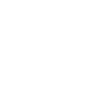

<!-- Improved compatibility of back to top link: See: https://github.com/juliancroeze/DoList/pull/73 -->

<!--
*** Thanks for checking out the DoList. If you have a suggestion
*** that would make this better, please fork the repo and create a pull request
*** or simply open an issue with the tag "enhancement".
*** Don't forget to give the project a star!
*** Thanks again! Now go create something AMAZING! :D
-->

<!-- PROJECT SHIELDS -->
<!--
*** I'm using markdown "reference style" links for readability.
*** Reference links are enclosed in brackets [ ] instead of parentheses ( ).
*** See the bottom of this document for the declaration of the reference variables
*** for contributors-url, forks-url, etc. This is an optional, concise syntax you may use.
*** https://www.markdownguide.org/basic-syntax/#reference-style-links
-->
[![Contributors][contributors-shield]][contributors-url]
[![Forks][forks-shield]][forks-url]
[![Stargazers][stars-shield]][stars-url]
[![Issues][issues-shield]][issues-url]
[![MIT License][license-shield]][license-url]

<!-- PROJECT LOGO -->
 

  

  <h3 align="center">DoList</h3>

  

    A modern and user-friendly task management application developed in C# and WinUI.
     
    <a href="https://github.com/juliancroeze/DoList/issues">Report Bug</a>
    ·
    <a href="https://github.com/juliancroeze/DoList/issues">Request Feature</a>
  

<!-- TABLE OF CONTENTS -->

  
Table of Contents

  <ol>
    <li>
      <a href="#about-the-project">About The Project</a>
      <ul>
        <li><a href="#built-with">Built With</a></li>
      </ul>
    </li>
    <li>
      <a href="#getting-started">Getting Started</a>
      <ul>
        <li><a href="#prerequisites">Prerequisites</a></li>
        <li><a href="#installation">Installation</a></li>
      </ul>
    </li>
    <li><a href="#usage">Usage</a></li>
    <li><a href="#roadmap">Roadmap</a></li>
    <li><a href="#contributing">Contributing</a></li>
    <li><a href="#license">License</a></li>
    <li><a href="#contact">Contact</a></li>
    <li><a href="#acknowledgments">Acknowledgments</a></li>
  </ol>

<!-- ABOUT THE PROJECT -->
## About The Project

[![DoList Screen Shot][product-screenshot]](https://example.com)

DoList is a simple and efficient task management tool designed to help you stay organized and productive. With this app, you can easily create, manage, and track your tasks and to-do lists. Say goodbye to scattered notes and forgotten tasks.

(<a href="#readme-top">back to top</a>)

### Built With

This is the list of major frameworks/libraries I used to create this project. Any add-ons/plugins that I use are mentioned in the  acknowledgments section.

* 
* [![csharp][csharp]][csharp-url]
* [![win3][win3]][win3-url]
* [![tsw][tsw]][tsw-url]

(<a href="#readme-top">back to top</a>)

<!-- GETTING STARTED -->
## Getting Started

Coming Soon...

(<a href="#readme-top">back to top</a>)

<!-- ROADMAP -->
## Roadmap

- [x] Set up development environment.
- [x] Create the main user interface.
- [x] Implement task creation functionality.
- [ ] Implement task editing and deletion functionality.
- [ ] Add filtering and sorting options.
- [ ] Add task priorities.
- [ ] Implement due date functionality.
- [ ] Create reminders and notifications.
- [ ] Add support for multiple languages.

(<a href="#readme-top">back to top</a>)

<!-- CONTRIBUTING -->
## Contributing

Contributions are what make the open source community such an amazing place to learn, inspire, and create. Any contributions you make are **greatly appreciated**.

If you have a suggestion that would make this better, please fork the repo and create a pull request. You can also simply open an issue with the tag "enhancement".
Don't forget to give the project a star! Thanks again!

1. Fork the Project
2. Create your Feature Branch (`git checkout -b feature/AmazingFeature`)
3. Commit your Changes (`git commit -m 'Add some AmazingFeature'`)
4. Push to the Branch (`git push origin feature/AmazingFeature`)
5. Open a Pull Request

(<a href="#readme-top">back to top</a>)

<!-- CONTACT -->
## Contact

Discord - [zzrp_](https://discordapp.com/users/1013574223396089890)

Project Link: [https://github.com/juliancroeze/DoList](https://github.com/juliancroeze/DoList)

(<a href="#readme-top">back to top</a>)

<!-- ACKNOWLEDGMENTS -->
## Acknowledgments

* [Best-README-Template](https://github.com/othneildrew/Best-README-Template)

(<a href="#readme-top">back to top</a>)

<!-- MARKDOWN LINKS & IMAGES -->
<!-- https://www.markdownguide.org/basic-syntax/#reference-style-links -->
[product-screenshot]: ToDoApp/Assets/Screenshot.PNG
[contributors-shield]: https://img.shields.io/github/contributors/juliancroeze/DoList.svg?style=for-the-badge
[contributors-url]: https://github.com/juliancroeze/DoList/graphs/contributors
[forks-shield]: https://img.shields.io/github/forks/juliancroeze/DoList.svg?style=for-the-badge
[forks-url]: https://github.com/juliancroeze/DoList/network/members
[stars-shield]: https://img.shields.io/github/stars/juliancroeze/DoList.svg?style=for-the-badge
[stars-url]: https://github.com/juliancroeze/DoList/stargazers
[issues-shield]: https://img.shields.io/github/issues/juliancroeze/DoList.svg?style=for-the-badge
[issues-url]: https://github.com/juliancroeze/DoList/issues
[license-shield]: https://img.shields.io/github/license/juliancroeze/DoList.svg?style=for-the-badge
[license-url]: https://github.com/juliancroeze/DoList/blob/master/LICENSE.txt
[linkedin-shield]: https://img.shields.io/badge/-LinkedIn-black.svg?style=for-the-badge&logo=linkedin&colorB=555
[linkedin-url]: https://linkedin.com/in/juliancroeze
[Next.js]: https://img.shields.io/badge/next.js-000000?style=for-the-badge&logo=nextdotjs&logoColor=white
[Next-url]: https://nextjs.org/
[React.js]: https://img.shields.io/badge/React-20232A?style=for-the-badge&logo=react&logoColor=61DAFB
[React-url]: https://reactjs.org/
[Vue.js]: https://img.shields.io/badge/Vue.js-35495E?style=for-the-badge&logo=vuedotjs&logoColor=4FC08D
[Vue-url]: https://vuejs.org/
[Angular.io]: https://img.shields.io/badge/Angular-DD0031?style=for-the-badge&logo=angular&logoColor=white
[Angular-url]: https://angular.io/
[Svelte.dev]: https://img.shields.io/badge/Svelte-4A4A55?style=for-the-badge&logo=svelte&logoColor=FF3E00
[Svelte-url]: https://svelte.dev/
[Laravel.com]: https://img.shields.io/badge/Laravel-FF2D20?style=for-the-badge&logo=laravel&logoColor=white
[Laravel-url]: https://laravel.com
[product-screenshot]: ToDoApp/Assets/Screenshot.PNG
[Bootstrap.com]: https://img.shields.io/badge/Bootstrap-563D7C?style=for-the-badge&logo=bootstrap&logoColor=white
[Bootstrap-url]: https://getbootstrap.com
[JQuery.com]: https://img.shields.io/badge/jQuery-0769AD?style=for-the-badge&logo=jquery&logoColor=white
[JQuery-url]: https://jquery.com 
[csharp]: https://img.shields.io/badge/C_Sharp-239120?style=for-the-badge&logo=csharp&logoColor=white
[csharp-url]: https://learn.microsoft.com/en-us/dotnet/csharp/
[wasdk]: https://img.shields.io/badge/Windows_App_SDK-0078D4?style=for-the-badge&logo=windows11&logoColor=white
[wasdk-url]: https://learn.microsoft.com/en-us/windows/apps/windows-app-sdk/
[win3]: https://img.shields.io/badge/WinUI_3-ffb900?style=for-the-badge&logo=windows11&logoColor=white
[win3-url]: https://learn.microsoft.com/en-us/windows/apps/winui/winui3/
[tsw]: https://img.shields.io/badge/Template_Studio_for_WinUI-0078D4?style=for-the-badge&logo=windows11&logoColor=white
[tsw-url]: https://marketplace.visualstudio.com/items?itemName=TemplateStudio.TemplateStudioForWinUICs
